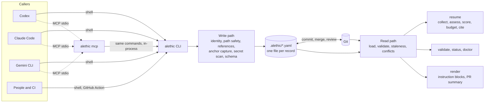
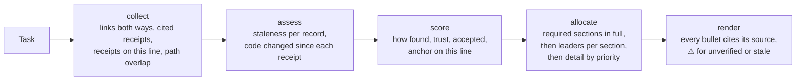

# Architecture

Aletheic is a CLI over a directory of YAML files. Every other surface (the MCP server, instruction blocks, the GitHub Action) goes through the same commands. There is no service, database, or network access.

## Write path

Every command that writes a record (`task`, `decision`, `knowledge`, `receipt`, `checkpoint`, `verify`, `doctor --fix`) does the same steps, in `src/core/write.ts`:

1. **Identity.** `--agent` or `ALETHIC_AGENT`, required.
2. **Path safety.** Paths must be repository-relative. Absolute paths, `..`, symlink escapes, and forbidden globs are refused. Globs expand only against `git ls-files`, and expansion is capped (`src/core/paths.ts`).
3. **References.** Linked records must exist and be the right kind.
4. **Anchor.** Git blob ids of the evidence files, then of scope matches, are captured up to a limit; the rest are summarized in an overflow digest (`src/core/anchor.ts`).
5. **Secret scan, then schema validation.** If either fails, nothing is written, and secret values are never echoed.
6. **Atomic write.** Written to a temporary file, then renamed.

Checkpoints and receipts are append-only. `validate` compares them with the version first committed.

## Read path

- **Assessment** (`src/validate/assess.ts`) is the shared read path. It loads records and runs the checks that need neither Git history nor the filesystem: schema, identity, references, secrets, trust labels, and forbidden paths. Records with excluding findings are withheld from the usable index. `resume`, `render pr-summary`, `checkpoint list/show`, MCP record resources, and the dashboard read only that index, so a hand-edited record cannot reach an agent without passing the same checks as `validate`.
- **Validation** (`src/validate/`) is the assessment plus leases, symlink containment, commits, append-only history, staleness, and contradictions. Each finding has a code, location, and hint.
- **Staleness** (`src/trust/staleness.ts`) compares anchored fingerprints with the working tree when a record is read. The status is derived and never written: `unchanged`, `scope_changed`, `uncertain`, `needs_reverification`, `diverged`, `broken_evidence`, or `unanchored`. Any change to direct evidence needs re-verification; an order-respecting line diff sizes it only to order review. Commit ancestry is only a hint, which is why records survive squash merges and shallow clones. Briefings, `validate`, and the dashboard all read these statuses from the same function.
- **Conflicts** (`src/trust/conflicts.ts`) finds contradictory decisions, overlapping claims, orphaned checkpoints, and superseded decisions that are still accepted. It uses the same scope-overlap rules as `resume`.

## Briefing compiler (`resume`)

The compiler is deterministic. It uses no embeddings and no model calls, and identical records and Git state produce byte-identical output. The budget is approximate (characters / 4). Failed approaches and open questions are kept before decisions and file lists when space is short, because they exist nowhere else. The target agent changes only the header and footer.

## Integrations

- **Instruction blocks** (`src/adapters/blocks.ts`): a short managed block between markers in `AGENTS.md`, `CLAUDE.md`, or `GEMINI.md`. Its job is the trigger: start from `alethic resume`.
- **MCP** (`src/mcp/`): a dependency-free JSON-RPC server over stdio. Each tool call runs the matching CLI command in-process, one call at a time, so validation and the secret scan cannot drift from the CLI. The official MCP SDK is used only in tests.
- **GitHub Action** (`action.yml`): runs `alethic validate` in CI.

## Source layout

| Directory | Contents |
|---|---|
| `schemas/` | JSON Schemas for every record kind and the manifest (the format's source of truth, with `docs/spec.md`) |
| `src/core/` | Records, ids, clock, YAML format, paths, manifest, anchors, and the write path |
| `src/git/` | Git via `execFile`, never a shell |
| `src/validate/` | Schema errors, references, secrets, leases, and the validator |
| `src/trust/` | Confidence ranks, staleness, and conflicts |
| `src/compile/` | `resume` collection, scoring, budgeting, the briefing, and PR summaries |
| `src/adapters/` | Managed instruction blocks |
| `src/mcp/` | MCP server, tool definitions, and stdio framing |
| `src/commands/` | One module per command |
| `test/` | Unit, spec-example, and end-to-end tests, fixtures, golden briefings, and the demo test |
