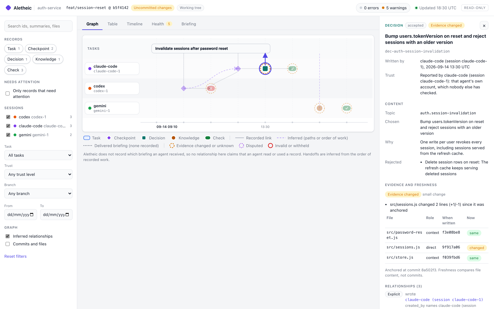

# Dashboard

`alethic dashboard` serves a read-only page on this machine that shows what agent sessions worked on, how work passed between them, which records connect them, and where evidence is stale, disputed, or invalid. It answers three questions: how did we get here, what would the next agent receive, and what can be trusted now?

```console
$ alethic dashboard
Aletheic dashboard: http://127.0.0.1:4700/
Read-only, and reachable only from this machine. Press Ctrl+C to stop.
```



| Option | Meaning |
|---|---|
| `--port <n>` | Port to listen on. Default 4700; `0` picks a free port. |
| `--host <address>` | `127.0.0.1` (default), `::1`, or `localhost`. Other addresses are refused. |
| `--snapshot <file>` | Write the data the page shows as JSON (`-` for stdout) and exit, without starting a server. |

## Views

- **Graph.** One lane per session, and a lane of tasks across the top. Records sit in the lane of the session that wrote them, in the order they were written, over a time axis. Task bars span the records that belong to them. Select a session lane, a task, or a record to highlight its relationships and dim the rest. Node shapes: diamond for checkpoints, square for decisions, circle for knowledge, pill for checks (✓ or ✕). Rings: dashed amber when evidence changed or applicability is unknown, dotted purple when a decision is disputed, red when a record is invalid or withheld. A small blue dot marks an attributed human confirmation. Commits and files are shown on request. Large ledgers show the latest 400 matching records, with a note; the table shows all of them.
- **Table.** Every matching record, sortable and paginated, as an accessible alternative to the graph.
- **Timeline.** Recorded activity in order: tasks started, claimed, paused, or closed; checkpoints; decisions; facts; checks; and inferred handoffs, labeled as inferred.
- **Health.** Invalid or withheld records, changed evidence, conflicting decisions, claims and ownership (expired leases, overlapping and competing claims, orphaned checkpoints), checks that no longer apply, and outdated confirmations. Each item links to its record and carries the CLI's hint.
- **Briefing.** Pick a task and a budget to see what `alethic resume` would give an agent now: every item with its level (full, short, or collapsed into a pointer line), how the compiler found it, and where the tokens went.
- **Inspector.** For a record: who wrote it (agent and session), what its trust label establishes, whether its evidence still matches the code (a file-by-file comparison of the anchored and current content), its content, every relationship with its basis and an explanation, its problems, and the record file with its revision. For a session: its records, the tasks it held, and its inferred handoffs.

Filters narrow every view: search, record kinds, sessions, task, needs attention, trust level, branch, and a date range. Keyboard: `/` focuses search, arrow keys move between graph nodes, Enter selects, and Escape closes the inspector.

## What an edge means

Every relationship says how it is known:

| Basis | Meaning | Examples |
|---|---|---|
| Explicit | A field in a record states it. | A checkpoint's `task`, `links`, `supersedes`, cited receipts, `created_by`, `owner`, evidence files, and anchor commits |
| Inferred | Derived, not recorded. | A decision whose paths overlap a task's scope; a **handoff**, when a different session worked on a task after another session's record |
| Delivered | A recorded briefing delivery. | None: Aletheic does not record which briefing an agent received |

A handoff edge shows the order of recorded work. It does not show that the later session read the earlier record, and no view presents a record as having been read, understood, or used by an agent. If briefing-delivery events are added later, they will be opt-in, versioned, and stored outside compiled briefings, and they will still say only that context was delivered.

## Guarantees and limits

- **The same assessments as the CLI.** The page is built from the shared record assessment, freshness, receipt applicability, conflict checks, and `validate`, so its error count matches `alethic validate` and its warnings include everything `validate` and `doctor` report.
- **Nothing is written.** The server answers only `GET` and `HEAD`. It never edits records, runs commands, or caches state; every response is computed from the working tree when requested, and the page reloads when records, HEAD, or uncommitted changes change.
- **Only this machine.** It listens on a loopback address, and rejects requests whose `Host` header is not `127.0.0.1`, `localhost`, or `[::1]` with its port, so a web page cannot reach it through DNS rebinding.
- **No network, no injected content.** The page loads nothing from the network. A per-response nonce in the Content-Security-Policy header is the only way script or style runs, and every piece of record text is inserted as text, never as HTML.
- **Private content stays out.** Records that fail validation (for example, one containing a secret) are shown only as withheld, with their file and finding codes; their content is not in the page, the API, or snapshots. `.alethic/local/` is never read. Record lookups take record ids, never file paths.
- **Current working tree only.** The view shows records and files as they are now, including uncommitted changes. Viewing the ledger at an earlier commit is not available yet.
